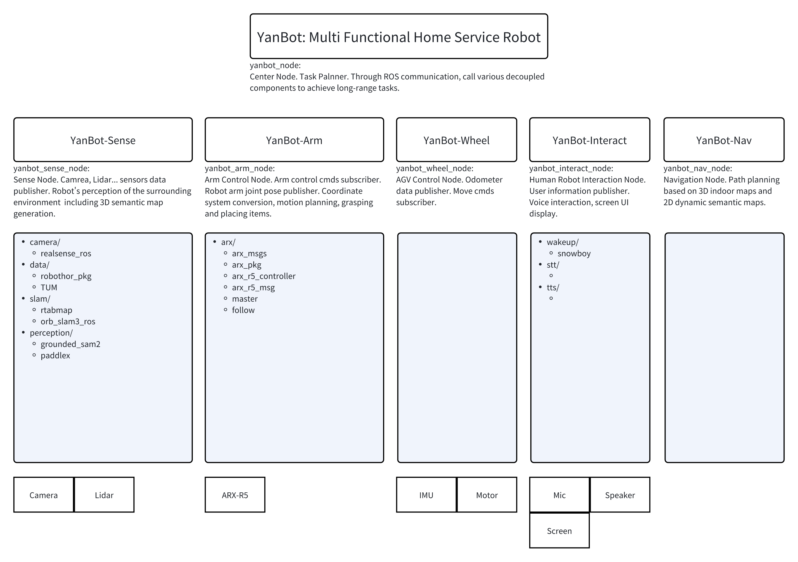

# YanBot

Welcome to YanBot, a self-developed home service robot designed to make your life easier and more comfortable.

## Parts and Modules of YanBot

YanBot is comprised of several decoupled parts, each with its own unique function.

### 1. [YanBot-Sense](https://github.com/yutian929/YanBot-Sense)

Sense Part. Camrea, Lidar... sensors data publisher. Robot's perception of the surrounding environment  including 3D semantic map generation. It includes some repos as module components:

- camera/
  - [realsense_ros](https://github.com/yutian929/YanBot-Sense_realsense_ros): Refined ROS wrapper for Intel RealSense cameras.
- data/
  - [robothor_pkg](https://github.com/yutian929/YanBot-Sense): RoboTHOR dataset. Wrapped in ROS.
  - [TUM](https://cvg.cit.tum.de/data/datasets/rgbd-dataset/download#): Visit [TUM]("https://cvg.cit.tum.de/data/datasets/rgbd-dataset/download#"), and download the rosbag you need.
- slam/
  - [rtabmap](http://wiki.ros.org/rtabmap_ros): Real-time Appearance-Based Mapping (RTAB-Map)
  - [orb_slam3_ros](https://github.com/yutian929/YanBot-Sense_orb_slam3_ros): A ROS implementation of ORB-SLAM3 V1.0 that focuses on the ROS part.
- perception/
  - [grounded_sam2](https://github.com/yutian929/YanBot-Sense_Grounded_SAM_2): Adapted Grounded_SAM_2, realize ROS integration in docker.
  - [paddlex](https://github.com/PaddlePaddle/PaddleX): a low-code development tool for AI models built on the PaddlePaddle framework.

### 2. [YanBot-Arm](https://github.com/yutian929/YanBot-Arm)

Arm Control Part. Arm control cmds subscriber. Robot arm joint pose publisher. Coordinate system conversion, motion planning, grasping and placing items.:

- arx/
  - [arx_pkg](https://github.com/yutian929/YanBot-Arm): ARX Robot Arm ROS package.

### 3. [YanBot-Wheel](https://github.com/yutian929/YanBot-Wheel)

AGV Control Part. Odometer data publisher. Move cmds subscriber.

- TODO
  - TODO

### 4. [YanBot-Interact](https://github.com/yutian929/YanBot-Interact)

Human Robot Interaction Part. User information publisher. Voice interaction, screen UI display.

- wakeup/
  - [snowboy](https://github.com/yutian929/YanBot-Interact_snowboy): Refined general purpose offline voice recognition tool. Add yanyan voice model. Wrapped in ROS.
- stt/
  - TODO
- tts/
  - TODO

## System Architecture

The following diagram provides an overview of the whole system architecture of YanBot. This diagram illustrates how each module and their respective components interact with each other to provide a seamless and efficient service.

Feel free to explore each module and component to gain a deeper understanding of how YanBot works. Your contributions and suggestions are always welcome!
